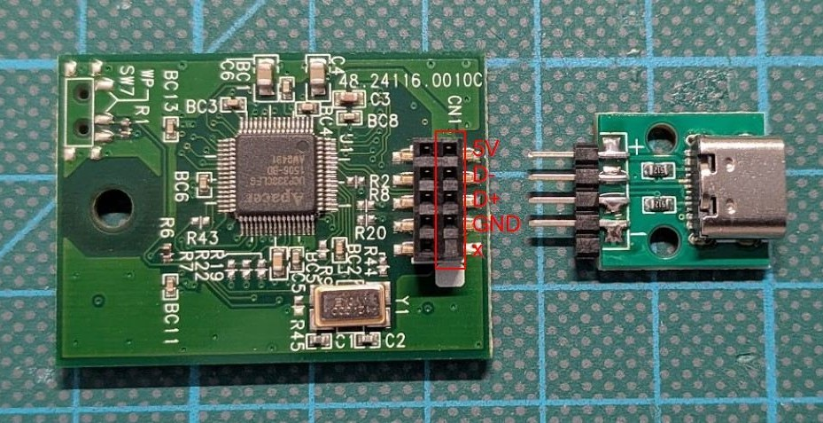

# Drobo 5N Reverse-Engineering
My Drobo 5N (Unit 1) died on me in May 2026. Here are some random notes and resources I gathered, trying to find out what ahppened.
It looks like one of the three 2 channel SATA Controllers died (more on that later).
I also bought another Drobo 5N (Unit 2) from eBay, to check some of my assumptions.

# Contents

| Directory | Description |
|---|---|
| [3D](3D/) | OpenSCAD and 3D-print files (PCB carrier) |
| [Disassembly](Disassembly/) | Disassembly instructions including images |
| [Datasheets](Datasheets/) | Component datasheets and reference material |
| [gfx](gfx/) | Images used in this repo (figures and photos) |
| [Unit1](Unit1/) | Unit 1: crashlogs, bootlogs, traces (PulseView), and USB-DOM files/image |
| [Unit2](Unit2/) | Unit 2: crashlogs, bootlogs, traces (PulseView), USB-DOM files |
| [USB-DOM](USB-DOM/) | Disk-on-module images and vxWorks files |

# USB DOM (Disk on Module)
The Drobo 5N comes with a 1GB FAT16 formatted internal USB drive. It uses a module which is connected using a 2mm pitch internal USB connector (like the ones on a regular PC motherboard, but smaller). You can make yourself an adapter with 2mm pitch Header-Pins.



# Timeline (Unit 1)
- 2026-05-01 19:34 MESZ Disk 3 dropped out?!?! (Timestamp via UFS Explorer recovery of Disk 3)
- 2026-05-03 03:19 MESZ (+-5min) Drobos httpd went offline (Timestamp via Monitoring)
- 2026-05-04 20:49 MESZ Noticed Drobo off with top slot green, 2nd slot red; No sign in Dashboard
- 2026-05-04 20:.. Tried to power off via Switch. Got untill all lights went dark but drive and fan didn't power down even after ~15 minutes; Removed Power-Plug
- 2026-05-04 20:.. Plugged back in, booted, all lights yellow, after few min top Red rest off; Dashboard sees Drobo and says no drives; Drives did not spin up!
- Powered on again without drives then inserted one totally different drive - did not spin up!

# Crashlogs (Unit 1)
- timestamp offset -9h; 2026-05-03 03:19 MESZ ~ 2026-05-02 18:19 in log
- crashlog-20260504-1210 shows drobo crashing

# Battery
The Battery is a 3.6V 2150mAh Li-Ion 18650 (Panasonic CGR 18650 CH). Model "Bumblebee b".
I measured:
- 4.12V between Red and Black under slight load (Multimeter Low-Z)
- 10k between Green and Black

# Power-Switch LED
- 3 Slow, 4 Fast: Performing Shutdown
- on: normal operation
- off: off/stand-by
-> MSP430 P4.6

# Power-Switch:
- Blue: Switch to white
- White: 3V
- Red: LED (GND?)
-> MSP430 P1.1

# PMU - MSP430F2252

## J11 (MSP430F2252 Prog)
- 1: Vcc
- 2: Test
- 3: Reset
- 4: GND

## Flash/Memory Layout
Boot: 0x0C00 - 0x0FFF (1kb) (Identical on Unit1/Unit2)
Info: 0x1000 - 0x10FF (256b; INFOA-INFOD)
Code: 0xC000 - 0xFFFF (16kb)

Remove J13 to read/write to MSP430 while drobo is powered (plugged in is enough).
While flashing, FAN might tun on.
Didn't try supplying 3V through J11.

## Failure Modes

### Cleared INFO Segments
https://www.youtube.com/live/jLmZw1f3uVw?t=13111

### Power Switch LED blinking rapidly and extremely faint (look closely in dark!) after plugging in
Probably caused by PMU constantly resetting and initial High-Z output of the PMU turns on the LED for just a few ms.
Probably due to corrupt INFO segment in flash.
https://www.youtube.com/live/jLmZw1f3uVw?t=10425

### Power Switch LED constantly blinking fast (~500ms 50% duty cicle) after plugging-in
PMU in FailSafe mode; FAN pulsing with LED.
No reaction to power switch.
Probably caused by corrupt INFO segment.

### Power Switch LED constantly blinking fast (~500ms 50% duty cicle) after power on
PMU in FailSafe mode; FAN at full speed

# Serial

## J3 (2.54 Header, populated, Linux)
- 1: 3V3 (marked)
- 2: RX (send to drobo)
- 3: TX @ 3V3 (drobo sends to you)
- 4: GND

## J2 (2.54 Header, unpopulated, VxWorks)
- 1: 3V3 (marked)
- 2: RX (send to drobo)
- 3: TX @ 3V3 (drobo sends to you)
- 4: GND

# Backplane - I2C IO Expanders (TCA9555)

## U13 - LEDs (Addr: 0x20)
- A0: GND
- A1: GND
- A2: GND
- P00: SLOT3_greenLed
- P01: SLOT3_redLed
- P02: SLOT2_greenLed
- P03: SLOT2_redLed
- P04: SLOT1_greenLed
- P05: SLOT1_redLed
- P06: SLOT0_greenLed
- P07: SLOT0_redLed
- P10: SLOT4_greenLed
- P11: SLOT4_redLed
- P12: TP22
- P13: TP21
- P14: TP20
- P15: TP19
- P16: TP18
- P17: TP17

## U15 - Disks (Addr: 0x23)
- A0: Vcc
- A1: Vcc
- A2: GND
- P00: SLOT3_diskPower
- P01: SLOT2_diskPower
- P02: SLOT1_diskPower
- P03: SLOT0_diskPower
- P04: SLOT4_diskPower
- P05: TP26
- P06: TP27
- P07: TP28
- P10: SLOT3_diskPresence
- P11: SLOT2_diskPresence
- P12: SLOT1_diskPresence
- P13: SLOT0_diskPresence
- P14: SLOT4_diskPresence
- P15: TP2x
- P16: TP2x
- P17: TP2x

## Disk sensing
Pin 6 of the SATA Connector (GND) is connected through 5K (R1/2/7/8/20) to an input on U15 Port 1.
The Input is pulled-down to GND via 100K.

> [!WARNING]  
> No clue how this should work. The input would always be pulled down?! However, I2C later reads all HIGH when no disk is connected

# I2C

GPIO Extenders U13 and U15 are controlled via I2C commands:

## Drobo PowerOff
Mesured on faulty Unit 1:
```
W 23 02 00 -> Output Port 0 (P00-P07) ALL OFF
```
## Drobo PowerUp
Mesured on faulty Unit 1 with no disk in place:
```
W 23 07 FF      P1 CNF ALL IN
R 23 01 :: FF   P1 GET ALL HIGH (diskPresence -> no disk present)

W 23 02 00      P0 SET ALL LOW
W 23 06 00      P0 CNF ALL OUT
W 23 03 00      P1 SET ALL LOW
W 23 07 1F      P1 CNF 0001 1111 (diskPresence IN)
```

Mesured on working Unit 1 with disk in slot 0:
```
W 23 07 FF      P1 CNF ALL IN
R 23 01 :: F7   P1 GET 11110111 (diskPresence -> Disk in Slot 0)

W 23 06 00      P0 CNF ALL OUT
W 23 02 00      P0 SET ALL LOW
W 23 07 1F      P1 CNF 0001 1111 (diskPresence IN)
W 23 03 00      P1 SET ALL LOW

R 23 01 :: 17   P1 GET 0001 0111 (diskPresence -> Disk in Slot 0)
R 23 01 :: 17   P1 GET 0001 0111 (diskPresence -> Disk in Slot 0)
R 23 01 :: 17   P1 GET 0001 0111 (diskPresence -> Disk in Slot 0)
R 23 01 :: 17   P1 GET 0001 0111 (diskPresence -> Disk in Slot 0)
R 23 01 :: 17   P1 GET 0001 0111 (diskPresence -> Disk in Slot 0)
R 23 00 :: 00   P0 GET 0000 0000 (Disk power is all off)
R 23 00 :: 00   P0 GET 0000 0000 (Disk power is all off)
R 23 00 :: 00   P0 GET 0000 0000 (Disk power is all off)
R 23 00 :: 00   P0 GET 0000 0000 (Disk power is all off)
R 23 00 :: 00   P0 GET 0000 0000 (Disk power is all off)
R 23 00 :: 00   P0 GET 0000 0000 (Disk power is all off)
W 23 02 08      P0 SET 0000 1000 (Power Slot 0)
R 23 00 :: 08   P0 GET 0000 1000 (Power is on for Slot 0)
W 23 02 08      P0 SET 0000 1000 (Power Slot 0)
R 23 00 :: 08   P0 GET 0000 1000 (Power is on for Slot 0)
W 23 02 08      P0 SET 0000 1000 (Power Slot 0)
R 23 00 :: 08   P0 GET 0000 1000 (Power is on for Slot 0)
W 23 02 08      P0 SET 0000 1000 (Power Slot 0)
R 23 00 :: 08   P0 GET 0000 1000 (Power is on for Slot 0)
W 23 02 08      P0 SET 0000 1000 (Power Slot 0)
R 23 01 :: 17   P1 GET 0001 0111 (diskPresence -> Disk in Slot 0)
R 23 01 :: 17   P1 GET 0001 0111 (diskPresence -> Disk in Slot 0)
R 23 01 :: 17
R 23 01 :: 17
R 23 01 :: 17
R 23 01 :: 17
...
```