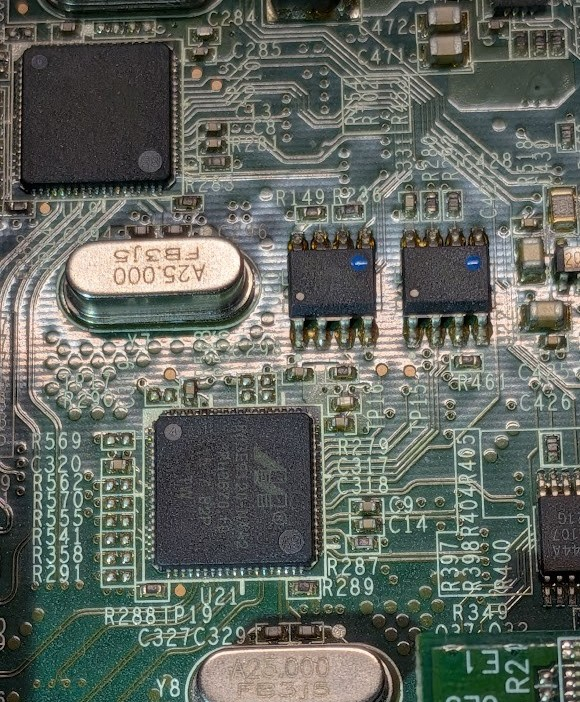
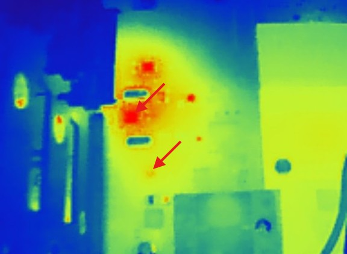
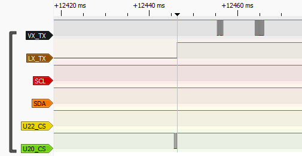
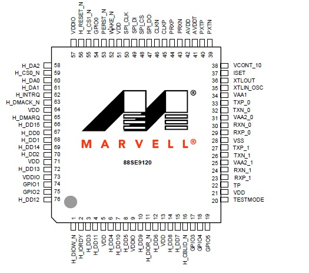
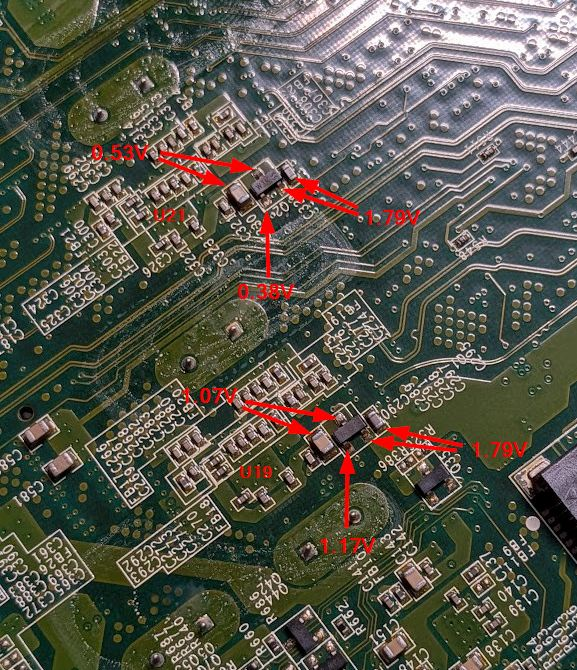
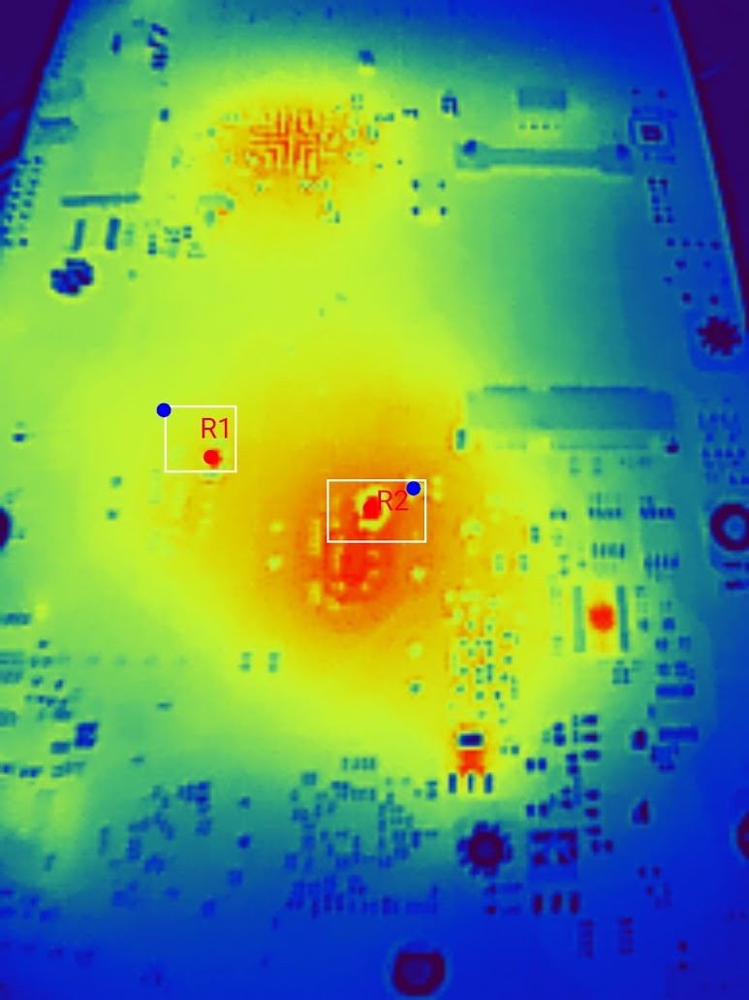
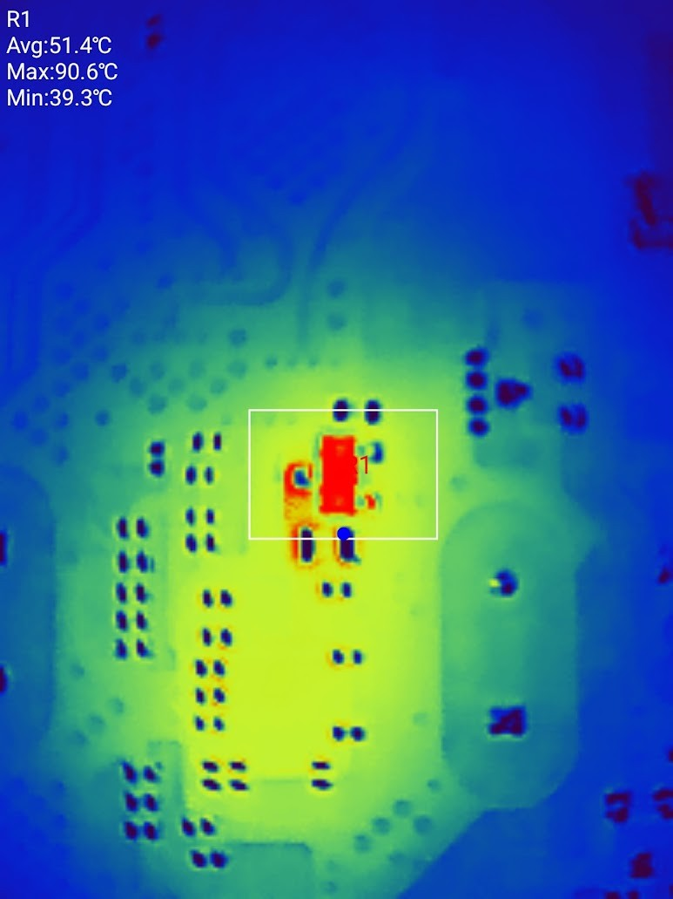
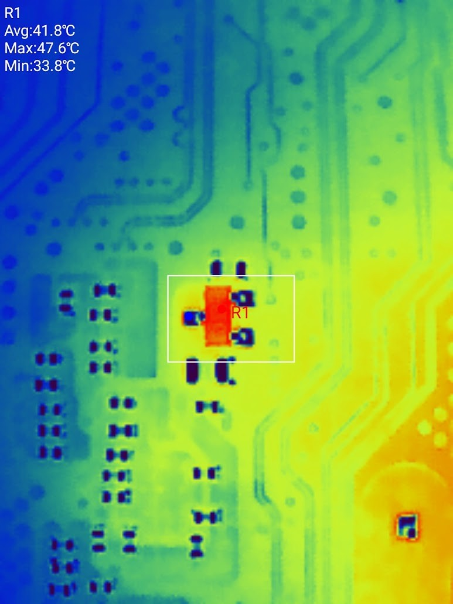

# Drobo 5N (Unit 1)
My own unit. One broken SATA Controller. Will power up and show on the network, but won't spin up any drives.

Software-Version: 4.2.1

## Troubleshooting

Suring boot, the VxWorks software shows:
```
  Dumping Disk Adapter Table
    Adapter Instance   Adapter Address   Adapter Data Address
           0            0x014B4298            0x04339C70
           1            0x014B4298            0x00000000
           2            0x014B42A8            0x0431B5D0

   Dumping Disk Slot Config Table:
    Adapter Instance   Connection    Physical Slot   Adapter Channel    Initialised    Device Pointer
        2                DRIVE             0              0                Yes           0x04304218
        1                DRIVE             1              0                 No           0x04304ABC
        1                DRIVE             2              1                 No           0x04305B70
        0                DRIVE             3              0                 No           0x04306414
        0                DRIVE             4              1                 No           0x04306CB8
        2                DRIVE             5              1                 No           0x0430755C
diskInterfaceInitialise: Adapter 1 Init Failed.
showDiskTbs: Dumping Disk Driver Config Tables:

  Dumping Disk Adapter Table
    Adapter Instance   Adapter Address   Adapter Data Address
           0            0x014B4298            0x04339C70
           1            0x014B4298            0x00000000
           2            0x014B42A8            0x0431B5D0

   Dumping Disk Slot Config Table:
    Adapter Instance   Connection    Physical Slot   Adapter Channel    Initialised    Device Pointer
        2                DRIVE             0              0                Yes           0x04304218
        1                DRIVE             1              0                 No           0x04304ABC
        1                DRIVE             2              1                 No           0x04305B70
        0                DRIVE             3              0                 No           0x04306414
        0                DRIVE             4              1                 No           0x04306CB8
        2                DRIVE             5              1                 No           0x0430755C
diskInterfaceInitialise: Completed Disk Driver Initialisation: FAILED
diskInterfacePostInit: Disk Controller Failed to initialise: Forcing system shutdown...
```

This indicates that something is wrong with SATA Adapter 1, which handles Slots 1 and 2. This matches the crashlog, which showed that my Drive in Slot 2 suddenly disappieared.

I've traced the SATA traces from the slots 2 and 3 to U21, Marvel 88SE9120 (with 4M Flash U22).



A thermal image shows that U21 is ~10°C colder than the working SATA controller U19.



Comparing signals on the Flash of the working and dead 88SE9120, shows that U21 is not talking to U22, while U19 indeed talks to U20.



I cannot find a full Datasheet of the 88SE9120, but I found this pinout:



As well as a short [datasheet for the 88SE9125](../Datasheets/88se9125-datasheet-668097cf16614605971775.pdf) which has the same PIN layout.

Both crystals are oscillating.

All Capacitors surrounding U21 on the top measure identical voltages to those around U19, so I guess these voltage rails are fine. The datasheet however mentions VCONT_10 (1.0V) which I cannot find.

Found VCONT_10 and its PNPs on the bottom side of the PCB. VCONT_10 of U21/Q2 is only 0.5V!




Q1 for VCONT_10 for U19 (1.0V):  


Q2 for VCONT_10 for U21 (0.5V):  



### 2026-06-19

Replacement Q2 arrived. After replacing, the Drobo was completely dead... It was sitting there on my table for 2 weeks and I didn't try it again before soldering. No clue what happened. I then noticed the power switch LED was very faintly blinking (like 10ms on 300ms off). This reminded me of scanlimes issue.

I now dumped the MSP430 flash and found the same issue - the INFO partition was partially overwritten. BSL and MAIN looked fine.

I dumped all partitions from my 2nd unit and the flashed the first half of the working INFO to my Drobo, as this was the corrupt part. Nothing, not even faint blinking anymore. I then flashed the whole INFO partition. But same. I've read the partitions back and noticed the MAIN was all 0xFF?! So I wrote the original back and finally it showed some signs of live!

It powers on, but all bay/front lights stay static and FAN is full power. The Switch LED flashes continuously (~500ms on, 500ms off).
There is no life on the serial ports either. The VxWorks shows a constant HIGH signal, the Linux one stays low.
Pressing the Power-Switch again powers it off.
Q2 generates stable 1V though!!
Same as: https://www.youtube.com/live/jLmZw1f3uVw?t=13111

I then tried to flash INFO and MAIN from the working Unit 2 to my one, and it actually kinda worked!
It powers on and initializes both cores!
The VxWorks reports:

```
82718580-82722723 UART: TX packets: Reading PMU Version...[0D][0A]
82722758-82733343 UART: TX packets: PMU Version: 0.0.0x0000, Failsafe Version 3 (Variant 0x000)[0D][0A]
82733379-82740133 UART: TX packets: Considering an Update to the PMU ... [0D][0A]
82740169-82759459 UART: TX packets: *************************************************************************************************************[0D][0A]
82759494-82778784 UART: TX packets: **** WARNING: PMU is currently running in FAILSAFE mode - limited functionality until it is reprogrammed ****[0D][0A]
82778819-82798109 UART: TX packets: *************************************************************************************************************[0D][0A]
82798144-82798457 UART: TX packets: [0D][0A]
82798492-82810296 UART: TX packets: Unit will be reprogrammed and rebooted due to PMU in Failsafe mode[0D][0A]
82810331-82819872 UART: TX packets: PMU is now in Failsafe Mode...Starting S-Record Dump:[0D][0A]
82819907-82820220 UART: TX packets: [0D][0A]
82820255-83712996 UART: TX packets: [  0]: .[08]PMU read longer than buffer: avail=4, length=2[0D][0A]
83713031-84191766 UART: TX packets: +.[08]+.[08]+.[08]+.[08]+.[08]+.[08]+.[08]+.[08]+.[08]+.[08]+.[08]+.[08]+.[08]+.[08]+.[08]0x40c7bf0 (BusM A): 0x40c7bf0 (BusM A): INFO: usb2Msc - Storage driver got a device attach notification.[0D][0A]
84191801-84203257 UART: TX packets: INFO: usb2Msc - Storage driver got a device attach notification.[0D][0A]
84204701-84404851 UART: TX packets: +.[08]+.[08]+.[08]+.[08]+.[08]+.[08]0x40c7bf0 (BusM A): 0x40c7bf0 (BusM A): INFO: usb2Msc - Mounting device (PDT 0x0 PQ 0x0 RMB 0x0) VID =          : PID = USB DISK MODULE  : REV = PMAP[0D][0A]
84404886-84424176 UART: TX packets: INFO: usb2Msc - Mounting device (PDT 0x0 PQ 0x0 RMB 0x0) VID =          : PID = USB DISK MODULE  : REV = PMAP[0D][0A]
84424211-84446113 UART: TX packets: 0x40c7bf0 (BusM A): 0x40c7bf0 (BusM A): INFO: usb2Msc - Device 0x2 LUN 0 of 1005568 (KB) will be mounted with base name /bd0[0D][0A]
84446148-84461086 UART: TX packets: INFO: usb2Msc - Device 0x2 LUN 0 of 1005568 (KB) will be mounted with base name /bd0[0D][0A]
84461121-84829383 UART: TX packets: +.[08]+.[08]+.[08]+.[08]+.[08]+.[08]+.[08]+.[08]+.[08]+.[08]+.[08]+.[08]+.[08][0D]/bd0/  - disk check in progress ...[0D][0A]
84829418-85056114 UART: TX packets: [0D]/bd0/vxWorks[0D]/bd0/LxImage +.[08][0D]/bd0/bootCount[0D]/bd0/Crashlogs [0D]/bd0/Crashlogs/crashlog-20260216-2342[0D]/bd0/Crashlogs/crashlog-20260224-0358 [0D]/bd0/Crashlogs/crashlog-20260330-1347 [0D]/bd0/Crashlogs/crashlog-20260504-1210 +.[08][0D]/bd0/Crashlogs/crashlog-20260504-1211 [0D]/bd0/Crashlogs/crashlog-20260504-1230 [0D]/bd0/Crashlogs/crashlog-20250728-0308 [0D]/bd0/Crashlogs/crashlog-20250821-1509 [0D]/bd0/Crashlogs/crashlog-20250824-2106 [0D]/bd0/Crashlogs/crashlog-20260504-1241 [0D]/bd0/Crashlogs/crashlog-20260509-0214 [0D]/bd0/Crashlogs/crashlog-20020418-2137 +.[08][0D]/bd0/Crashlogs/crashlog-20020418-2139 [0D]/bd0/Crashlogs/crashlog-20020418-2232 [0D]/bd0/Crashlogs/crashlog-20020418-2242 [0D]/bd0/Crashlogs/crashlog-20020418-2301 [0D]/bd0/Crashlogs/crashlog-20020418-2309 [0D]/bd0/Crashlogs/crashlog-20020418-2321 [0D]/bd0/Crashlogs/crashlog-20020418-2327 [0D]/bd0/Crashlogs/crashlog-20000322-0301 [0D]/bd0/Crashlogs/crashlog-20000322-0315 +.[08][0D]/bd0/Crashlogs/crashlog-20000302-1302 [0D]/bd0/Crashlogs/crashlog-20040602-2355 [0D]/bd0/Crashlogs/crashlog-20800402-0204 [0D]/bd0/Crashlogs/crashlog-20000302-0400 [0D]/bd0/Crashlogs/crashlog-20000302-0417 [0D]/bd0/NoCrashMsg                       [0D]/bd0/hibLog     [0D]/bd0/hibHdr [0D]/bd0/amitLog[0D]/bd0/vxWorks_prev+.[08][0D]/bd0/FlashConfigData[0D]/bd0/J2              [0D]/bd0/J1 +[0D][0A]
85056149-85566885 UART: TX packets: [ 40]: .[08]+.[08]+.[08][0D]/bd0/hdr[0D]/bd0/UBSW.bin+.[08][0D]/bd0/UBSW.hdr [0D]/bd0/LxHdr    [0D]/bd0/runesa.vxe[0D]/bd0/eventLog   [0D]/bd0/hdr_prev [0D]/bd0/LxImage_prev+.[08][0D]/bd0/LxHdr_prev   [0D]/bd0/runesa_prev.vxe[0D]/bd0/rtphdr_prev     [0D]/bd0/userEventLog[0D]/bd0/rtphdr       [0D]/bd0/J1TAGS [0D]/bd0/AMIT   +.[08][0D]/bd0/RebootReason[0D]/bd0/System Volume Information[0D]/bd0/System Volume Information/WPSettings.dat[0D]/bd0/System Volume Information/IndexerVolumeGuid[0D]/bd0/$RECYCLE.BIN                                [0D]/bd0/$RECYCLE.BIN/desktop.ini                    +.[08][0D]                                                                                                                    [0D]+.[08]+.[08]+.[08]+.[08]+.[08]+.[08]+.[08]+.[08]+.[08]+.[08][0D]/bd0/  - Volume is OK [0D][0A]
85566920-85567233 UART: TX packets: [0D][0A]
85567268-85574197 UART: TX packets:           total # of clusters:  62,580[0D][0A]
85574232-85580813 UART: TX packets:          # of free clusters:  44,635[0D][0A]
85580848-85586558 UART: TX packets:           # of bad clusters:  0[0D][0A]
85586593-85593870 UART: TX packets:            total free space:  714,160 Kb[0D][0A]
85593905-86007156 UART: TX packets: +.[08]+.[08]+.[08]+.[08]+.[08]+.[08]+.[08]+.[08]+.[08]+.[08]+.[08]+.[08]+.[08]    max contiguous free space:  731,136,000 bytes[0D][0A]
86007191-86013076 UART: TX packets:                  # of files:  56[0D][0A]
86013111-86018821 UART: TX packets:                # of folders:  3[0D][0A]
86018856-86026133 UART: TX packets:        total bytes in files:  286,602 Kb[0D][0A]
86026168-86031879 UART: TX packets:            # of lost chains:  0[0D][0A]
86031914-86037972 UART: TX packets:    total bytes in lost chains:  0[0D][0A]
86038007-86338819 UART: TX packets: +.[08]+.[08]+.[08]+.[08]+.[08]+.[08]+.[08]+.[08]+.[08]+.[08]+[0D][0A]
86338854-87672320 UART: TX packets: [ 80]: .[08]+.[08]+.[08]+.[08]+.[08]+.[08]+.[08]+.[08]+.[08]+.[08]+.[08]+.[08]+.[08]+.[08]+.[08]+.[08]+.[08]+.[08]+.[08]+.[08]+.[08]+.[08]+.[08]+.[08]+.[08]+.[08]+.[08]+.[08]+.[08]+.[08]+.[08]+.[08]+.[08]+.[08]+.[08]+.[08]+.[08]+.[08]+.[08]+.[08]+[0D][0A]
87672355-88130586 UART: TX packets: [120]: .[08]+.[08]+.[08]+.[08]+.[08]+.[08]+.[08]+.[08]+.[08]+.[08]+.[08]+.[08]+.[08]+.[08]0x37078e0 (tErfTask): 0x37078e0 (tErfTask): INFO: usb2Msc - Device /bd0 has been claimed by filesystem[0D][0A]
88130621-88141032 UART: TX packets: INFO: usb2Msc - Device /bd0 has been claimed by filesystem[0D][0A]
88141067-88151652 UART: TX packets: NOTIFY: hDevice 0x2 lun 0 medium changed (mediumInsert = 1)[0D][0A]
88151687-89005776 UART: TX packets: +.[08]+.[08]+.[08]+.[08]+.[08]+.[08]+.[08]+.[08]+.[08]+.[08]+.[08]+.[08]+.[08]+.[08]+.[08]+.[08]+.[08]+.[08]+.[08]+.[08]+.[08]+.[08]+.[08]+.[08]+.[08]+.[08]+[0D][0A]
89005811-90339273 UART: TX packets: [160]: .[08]+.[08]+.[08]+.[08]+.[08]+.[08]+.[08]+.[08]+.[08]+.[08]+.[08]+.[08]+.[08]+.[08]+.[08]+.[08]+.[08]+.[08]+.[08]+.[08]+.[08]+.[08]+.[08]+.[08]+.[08]+.[08]+.[08]+.[08]+.[08]+.[08]+.[08]+.[08]+.[08]+.[08]+.[08]+.[08]+.[08]+.[08]+.[08]+.[08]+[0D][0A]
90339308-91672771 UART: TX packets: [200]: .[08]+.[08]+.[08]+.[08]+.[08]+.[08]+.[08]+.[08]+.[08]+.[08]+.[08]+.[08]+.[08]+.[08]+.[08]+.[08]+.[08]+.[08]+.[08]+.[08]+.[08]+.[08]+.[08]+.[08]+.[08]+.[08]+.[08]+.[08]+.[08]+.[08]+.[08]+.[08]+.[08]+.[08]+.[08]+.[08]+.[08]+.[08]+.[08]+.[08]+[0D][0A]
91672806-93006270 UART: TX packets: [240]: .[08]+.[08]+.[08]+.[08]+.[08]+.[08]+.[08]+.[08]+.[08]+.[08]+.[08]+.[08]+.[08]+.[08]+.[08]+.[08]+.[08]+.[08]+.[08]+.[08]+.[08]+.[08]+.[08]+.[08]+.[08]+.[08]+.[08]+.[08]+.[08]+.[08]+.[08]+.[08]+.[08]+.[08]+.[08]+.[08]+.[08]+.[08]+.[08]+.[08]+[0D][0A]
93006305-94339764 UART: TX packets: [280]: .[08]+.[08]+.[08]+.[08]+.[08]+.[08]+.[08]+.[08]+.[08]+.[08]+.[08]+.[08]+.[08]+.[08]+.[08]+.[08]+.[08]+.[08]+.[08]+.[08]+.[08]+.[08]+.[08]+.[08]+.[08]+.[08]+.[08]+.[08]+.[08]+.[08]+.[08]+.[08]+.[08]+.[08]+.[08]+.[08]+.[08]+.[08]+.[08]+.[08]+[0D][0A]
94339800-95673304 UART: TX packets: [320]: .[08]+.[08]+.[08]+.[08]+.[08]+.[08]+.[08]+.[08]+.[08]+.[08]+.[08]+.[08]+.[08]+.[08]+.[08]+.[08]+.[08]+.[08]+.[08]+.[08]+.[08]+.[08]+.[08]+.[08]+.[08]+.[08]+.[08]+.[08]+.[08]+.[08]+.[08]+.[08]+.[08]+.[08]+.[08]+.[08]+.[08]+.[08]+.[08]+.[08]+[0D][0A]
95673339-97006801 UART: TX packets: [360]: .[08]+.[08]+.[08]+.[08]+.[08]+.[08]+.[08]+.[08]+.[08]+.[08]+.[08]+.[08]+.[08]+.[08]+.[08]+.[08]+.[08]+.[08]+.[08]+.[08]+.[08]+.[08]+.[08]+.[08]+.[08]+.[08]+.[08]+.[08]+.[08]+.[08]+.[08]+.[08]+.[08]+.[08]+.[08]+.[08]+.[08]+.[08]+.[08]+.[08]+[0D][0A]
97006836-98340261 UART: TX packets: [400]: .[08]+.[08]+.[08]+.[08]+.[08]+.[08]+.[08]+.[08]+.[08]+.[08]+.[08]+.[08]+.[08]+.[08]+.[08]+.[08]+.[08]+.[08]+.[08]+.[08]+.[08]+.[08]+.[08]+.[08]+.[08]+.[08]+.[08]+.[08]+.[08]+.[08]+.[08]+.[08]+.[08]+.[08]+.[08]+.[08]+.[08]+.[08]+.[08]+.[08]+[0D][0A]
98340296-99673754 UART: TX packets: [440]: .[08]+.[08]+.[08]+.[08]+.[08]+.[08]+.[08]+.[08]+.[08]+.[08]+.[08]+.[08]+.[08]+.[08]+.[08]+.[08]+.[08]+.[08]+.[08]+.[08]+.[08]+.[08]+.[08]+.[08]+.[08]+.[08]+.[08]+.[08]+.[08]+.[08]+.[08]+.[08]+.[08]+.[08]+.[08]+.[08]+.[08]+.[08]+.[08]+.[08]+[0D][0A]
99673789-101007251 UART: TX packets: [480]: .[08]+.[08]+.[08]+.[08]+.[08]+.[08]+.[08]+.[08]+.[08]+.[08]+.[08]+.[08]+.[08]+.[08]+.[08]+.[08]+.[08]+.[08]+.[08]+.[08]+.[08]+.[08]+.[08]+.[08]+.[08]+.[08]+.[08]+.[08]+.[08]+.[08]+.[08]+.[08]+.[08]+.[08]+.[08]+.[08]+.[08]+.[08]+.[08]+.[08]+[0D][0A]
101007286-102340754 UART: TX packets: [520]: .[08]+.[08]+.[08]+.[08]+.[08]+.[08]+.[08]+.[08]+.[08]+.[08]+.[08]+.[08]+.[08]+.[08]+.[08]+.[08]+.[08]+.[08]+.[08]+.[08]+.[08]+.[08]+.[08]+.[08]+.[08]+.[08]+.[08]+.[08]+.[08]+.[08]+.[08]+.[08]+.[08]+.[08]+.[08]+.[08]+.[08]+.[08]+.[08]+.[08]+[0D][0A]
102340789-103674249 UART: TX packets: [560]: .[08]+.[08]+.[08]+.[08]+.[08]+.[08]+.[08]+.[08]+.[08]+.[08]+.[08]+.[08]+.[08]+.[08]+.[08]+.[08]+.[08]+.[08]+.[08]+.[08]+.[08]+.[08]+.[08]+.[08]+.[08]+.[08]+.[08]+.[08]+.[08]+.[08]+.[08]+.[08]+.[08]+.[08]+.[08]+.[08]+.[08]+.[08]+.[08]+.[08]+[0D][0A]
103674284-104841325 UART: TX packets: [600]: .[08]+.[08]+.[08]+.[08]+.[08]+.[08]+.[08]+.[08]+.[08]+.[08]+.[08]+.[08]+.[08]+.[08]+.[08]+.[08]+.[08]+.[08]+.[08]+.[08]+.[08]+.[08]+.[08]+.[08]+.[08]+.[08]+.[08]+.[08]+.[08]+.[08]+.[08]+.[08]+.[08]+.[08]+.[08]+.[08]![0D][0A]
104841360-104852119 UART: TX packets: ...Sending Final (S9) Record ... PMU-reboot should follow...[0D][0A]

```

Then it reboots and the Power Switch LED and Fan (!) blinks on/off every 500ms. It won't respond to the power switch. Unpluging and repluging immediately causes this blinking.

